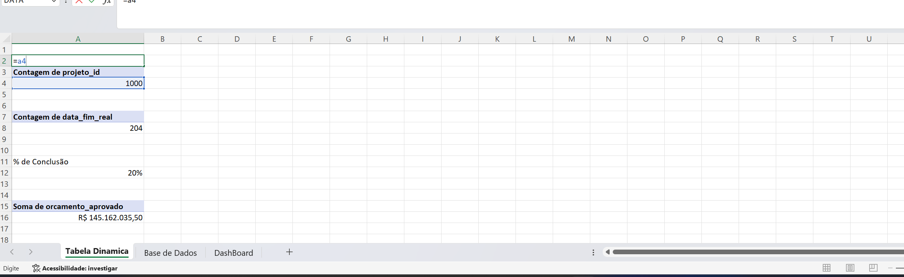
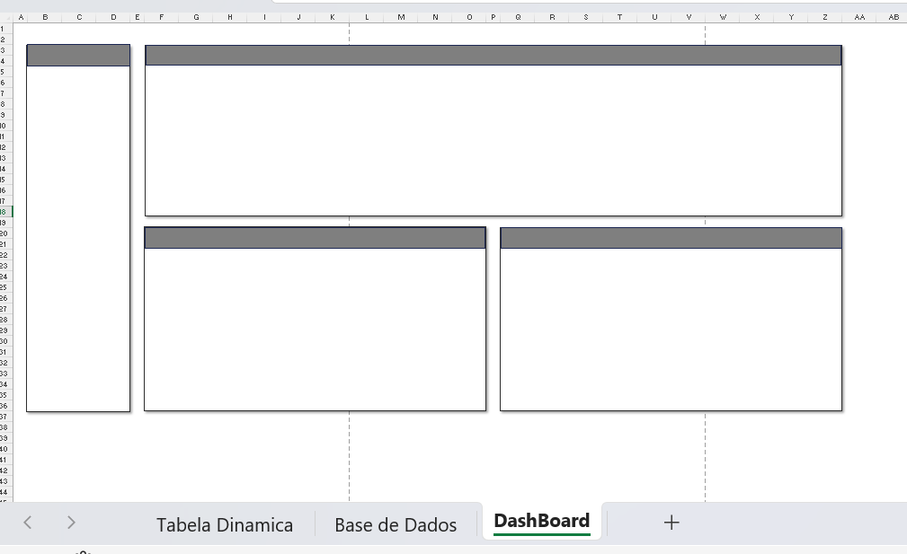
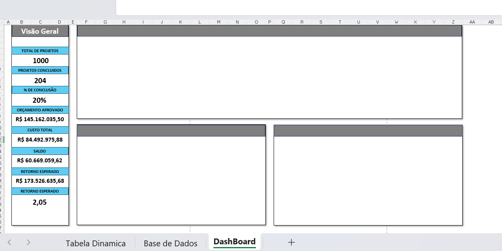
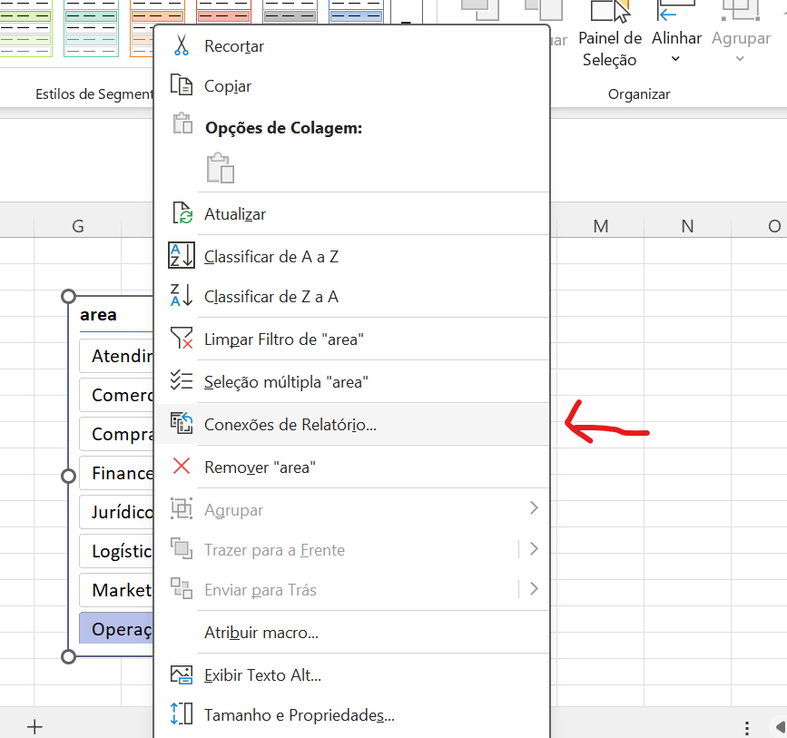
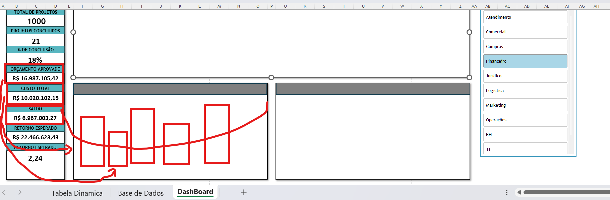
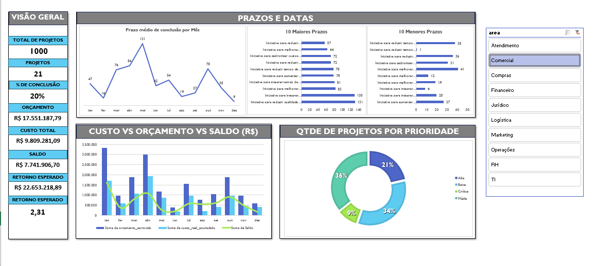

# Dashboard de Gestão de Projetos no Excel

**Autor:** Mateus Ferreira Gomes

---

## 📌 Sobre o Projeto

Este repositório contém o passo a passo da construção de um Dashboard de Gestão de Projetos desenvolvido no Microsoft Excel, cobrindo desde a etapa de tratamento e organização da base de dados até a estruturação das análises dinâmicas, indicadores (KPIs) e gráficos visuais.

---

## 🛠️ Etapas do Desenvolvimento

### 1. Download da planilha
Primeiramente, foi realizado o download da planilha com os dados que seriam utilizados.

### 2. Organização dos dados
Em seguida, os dados foram organizados e ajustados, corrigindo formatos e deixando as informações padronizadas.

### 3. Transformação em tabela
Após a organização, os dados foram transformados em uma tabela para facilitar a utilização dos filtros e ferramentas do Excel.

### 4. Criação da Tabela Dinâmica
Então, foi criada uma Tabela Dinâmica para resumir, organizar e facilitar a análise das informações.

---

## 📊 Construção das Análises (Tabelas Dinâmicas)

* **5. Contagem de projetos:** A primeira análise foi identificar quantos projetos existem. Para isso, utilizei a coluna `projeto_id` e a arrastei para a área de Valores da Tabela Dinâmica. O Excel realizou automaticamente a contagem.
* **6. Projetos concluídos:** A segunda análise foi identificar quantos projetos foram concluídos. Para isso, utilizei a coluna `data_fim_real` e a arrastei para a área de Valores, obtendo a contagem dos projetos finalizados.
* **7. Percentual de conclusão:** A terceira análise foi calcular qual percentual dos projetos foi concluído em relação ao total. Para isso, dividi a contagem de `data_fim_real` pela contagem de `projeto_id` e, em seguida, formatei o resultado como porcentagem.
* **8. Orçamento aprovado:** A quarta análise foi descobrir o valor de orçamento que tinha aprovado. Para isso, peguei a coluna de orçamento aprovado e também arrastei para valores, e o Excel dessa vez, como o valor estava em moeda, me devolveu a soma de todos os orçamentos que tinha aprovado.
* **9. Custo real gasto:** A quinta análise que fiz foi querer saber qual foi o custo real que foi gasto, então fiz o mesmo processo de arrastar a coluna `custo_real_acumulado` e o Excel me retornou a soma do valor de custo real.
* **10. Saldo remanescente:** A sexta análise que fiz foi tentar saber qual que era o saldo que ainda tinha, e esse cálculo foi fazer a coluna de orçamento aprovado - `custo_real_acumulado` e obter o saldo.
* **11. Benefícios esperados:** A sétima análise foi trazer a soma dos benefícios esperados anuais para que na próxima etapa seja possível calcular o ROI, então arrastei a coluna de `beneficios_esperado_anual` para valores e o Excel me devolveu o cálculo.
* **12. Cálculo do ROI (Retorno sobre Investimento):** A oitava análise foi descobrir qual que era o ROI (retorno do investimento), para saber o retorno de investimento que tive. Então peguei `beneficio_esperado_anual` / `custo_real_acumulado` e obtive o ROI, que é o nosso cálculo de retorno de investimento. O Excel me retornou um número com muitas casas decimais, então padronizei apenas para duas casas após a vírgula.

---

## 📐 Construção e Design do Dashboard

### 13. Extração dos Resultados
Para começar a criar o Dashboard, precisei extrair os resultados da tabela dinâmica para cima de cada uma referenciando esse resultado, para que dentro do dashboard eu possa criar os cartões de KPIs.

### 14. Layout Inicial
Criei uma nova planilha com nome de DashBoard e comecei a criação do design com as formas. Então removi a exibição das linhas de grade para que o visual ficasse mais atraente, e a versão inicial ficou assim:

### 15. Adição dos Cartões
Então finalizei a primeira etapa do dashboard, que foi colocar os cartões:

### 16. Segmentação de Dados (Filtros)
Nessa etapa adicionei uma segmentação de dados para que seja possível filtrar por área. Fiz também a conexão com todos os cartões do dashboard.

  

---

## 📈 Visualizações e Gráficos

### 17. Primeiro Gráfico (Orçamento x Custo x Saldo Mês a Mês)
Para o primeiro gráfico escolhi o modelo de Barras, fiz a diferença do valor do orçamento aprovado com o custo real para poder obter o saldo mês a mês. Precisei criar uma coluna auxiliar de saldo dentro da tabela.

### 18. Segundo Gráfico (Análise por Prioridade)
O segundo gráfico escolhi o modelo de rosca. Nesse gráfico fiz a análise de prioridade, sendo alta, média e baixa. Criei uma outra tabela dinâmica e arrastei a coluna prioridade para linhas e para valores para que seja somado quanto de cada prioridade foi obtido.

### 19. Terceiro Gráfico (Duração Média dos Projetos Mês a Mês)
Para o terceiro gráfico decidi calcular a duração média de cada projeto mês a mês. Para isso precisei criar uma outra coluna auxiliar com o nome de `Prazo`, e utilizei a função `=SE()` pois nem todos os projetos foram finalizados ainda, e para poder fazer o cálculo calculei a diferença do início para o fim. Depois volto na tabela dinâmica e arrasto a nova coluna `Prazo` para valores, porém ele soma os valores e precisamos calcular a média. Então preciso entrar em configurações de campo do valor e trocar contagem por média. Após isso arrastei a data de início real para linhas, e também alterei em configurações de campo do valor a redução das casas decimais e deixei em número para que o valor da média ficasse menor e mais visual, e após inseri um gráfico de linha.

### 20. Últimos Gráficos (Top 10 Maiores e Menores Prazos)
Para os últimos gráficos decidi analisar os 10 maiores e menores prazos por projetos, para saber quais são os 10 projetos que foram finalizados de forma mais rápida e os 10 que mais demoraram (Top 10).

### 21. Layout Final do Dashboard
Após todas as etapas de construção, análises, segmentações e gráficos, o dashboard foi finalizado com sucesso. O resultado final integra todos os cartões de KPIs, os gráficos analíticos, os filtros de segmentação e proporciona uma visão completa e dinâmica da gestão de projetos.

